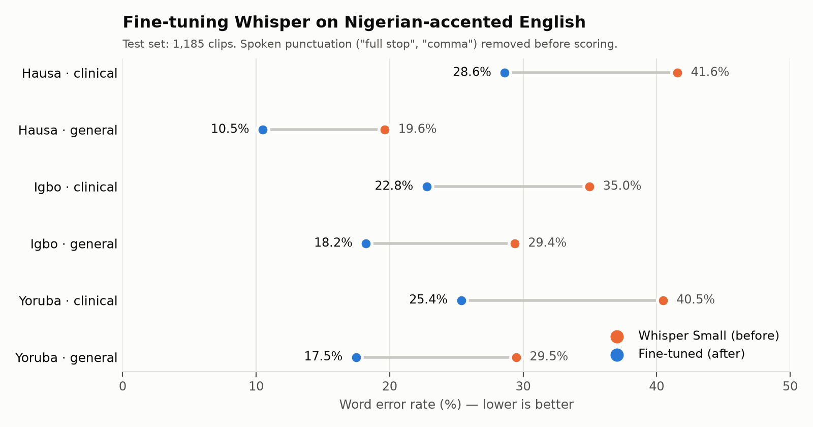

# Fine-tuning Whisper for Nigerian-Accented Clinical English

Speech recognition works well for American and British English, but much worse for African accents, and worst of all on medical vocabulary. This project measures how badly OpenAI's Whisper Small transcribes Nigerian-accented English (Hausa, Igbo and Yoruba accents), in clinical and general speech, and how much fine-tuning on 15 hours of Nigerian-accented speech improves it.

**Result:** fine-tuning cut the word error rate from **33.1% to 20.7%** (an improvement of 12.5 points, 95% CI 11.2–13.8) on a held-out test set of 1,185 clips from speakers never seen in training. Every accent and domain improved. The fine-tuned model also slightly outperforms the off-the-shelf **Whisper Large-v3**, a model about six times its size (20.7% vs 22.1%). Clinical speech remains harder than general speech.

**Fine-tuned model:** [DivineAngel317/whisper-small-nigerian-accented-english](https://huggingface.co/DivineAngel317/whisper-small-nigerian-accented-english) on Hugging Face



## Why this matters

Clinical speech recognition lets doctors dictate notes instead of typing them. It is widely used in countries whose accents these systems were built around, but it performs poorly for African-accented speech, in regions where doctors are scarce and their time is most valuable. Before fine-tuning, Whisper misread terms such as "ulna" as "owner" and "X-ray" as "X iPhone Re", errors that change the meaning of a clinical note.

## Data

- **Dataset:** [AfriSpeech-200](https://huggingface.co/datasets/intronhealth/afrispeech-200) (Olatunji et al., 2023): 200 hours of African-accented English, read aloud, in clinical and general domains. Licensed CC BY-NC-SA 4.0 (non-commercial).
- **Accents used:** Hausa, Igbo and Yoruba, the three largest Nigerian accents in the dataset.

| Set | Clips | Hours | Use |
|---|---:|---:|---|
| Train | 5,431 | 15.0 | ~5 hours per accent (balanced), randomly sampled with a fixed seed |
| Dev | 689 | 1.7 | Model selection during training |
| Test | 1,185 | 3.0 | Final evaluation, identical for both models |

Data checks:
- **No speaker appears in both training and test data**, so the test always measures performance on new voices.
- Clips longer than 30 seconds (Whisper's input limit) were excluded from all sets. This removed 14 test clips.
- About 70% of training clips are clinical speech.

## Method

- **Model:** `openai/whisper-small` (244M parameters)
- **Fine-tuning:** 3 epochs (1,062 steps), batch size 16, learning rate 1e-5 with 100 warm-up steps, mixed precision (fp16), gradient checkpointing. The checkpoint with the lowest dev WER was kept.
- **Hardware:** one NVIDIA T4 GPU on Kaggle (training took 52 minutes)
- **Evaluation:** word error rate (WER), after applying Whisper's official English text normaliser to both the reference and the prediction, so that capitalisation and punctuation are not counted as errors.

### A data artefact, and how it was handled

Many AfriSpeech speakers read punctuation aloud ("…flooding it, full stop."), but the reference transcripts never include these words. The original Whisper writes them out, so each one is scored as an error: "full stop" appeared in 308 of the baseline's test transcriptions and "comma" in 102. To separate genuine recognition errors from this convention, results are reported two ways:

- **Raw WER:** the standard measure
- **Adjusted WER:** "full stop" and "comma" removed from model output before scoring. This is safe because these words never occur in any test reference.

The fine-tuned model learned the convention (it wrote "full stop" in only 1 clip), so its raw and adjusted WER are the same. The adjusted comparison is the fair measure of improved recognition.

## Results

**Overall**

| Model | Raw WER | Adjusted WER |
|---|---:|---:|
| Whisper Small (before) | 37.7% | 33.1% |
| Fine-tuned (after) | **20.7%** | **20.7%** |

Improvement in adjusted WER: **12.5 points (95% CI 11.2–13.8)**, from a paired bootstrap over test clips (2,000 resamples).

Of the 17-point drop in raw WER, about 4.6 points came from learning the spoken-punctuation convention and about 12.4 points from better recognition of the speech itself.

**By accent and domain (adjusted WER)**

| Accent | Domain | Before | After | Change |
|---|---|---:|---:|---:|
| Hausa | Clinical | 41.6% | 28.6% | −13.0 |
| Hausa | General | 19.6% | 10.5% | −9.1 |
| Igbo | Clinical | 35.0% | 22.8% | −12.2 |
| Igbo | General | 29.4% | 18.2% | −11.2 |
| Yoruba | Clinical | 40.5% | 25.4% | −15.1 |
| Yoruba | General | 29.5% | 17.5% | −12.0 |

The improvement is statistically clear in every group: the lower end of the 95% confidence interval for the gain is at least 5.9 points in all six. Full intervals are in `results/wer_confidence_intervals.csv`. Per-group estimates are less precise than the overall figure; Hausa clinical, for example, rests on 137 clips.

**Training progress (dev set)**

| Epoch | Training loss | Dev loss | Dev WER |
|---:|---:|---:|---:|
| 1 | 0.675 | 0.711 | 20.2% |
| 2 | 0.421 | 0.682 | 20.0% |
| 3 | 0.263 | 0.685 | 19.5% |

Most of the gain came in the first epoch. Dev loss stopped improving after epoch 2 while training loss kept falling, an early sign of overfitting, so more epochs are unlikely to help. More data is the more promising route.

## Is a bigger model enough? Fine-tuned Small vs off-the-shelf Large-v3

A natural alternative to fine-tuning is to use the largest available model as it is. Whisper Large-v3 (1.55B parameters, about six times the size of Small) was evaluated on the same test set without fine-tuning.

| Model | Parameters | Raw WER | Adjusted WER |
|---|---:|---:|---:|
| Whisper Small (off-the-shelf) | 244M | 37.7% | 33.1% |
| Whisper Large-v3 (off-the-shelf) | 1.55B | 27.2% | 22.1% |
| Whisper Small (fine-tuned) | 244M | **20.7%** | **20.7%** |

- **The spoken-punctuation correction matters even more here.** Large-v3 wrote out "full stop" in 401 of 1,184 test clips. On raw WER it appears 6.5 points worse than the fine-tuned model; after correction the gap is **1.4 points (95% CI 0.5–2.3)**. Without the correction, the comparison would have substantially overstated the benefit of fine-tuning.
- **Overall, the fine-tuned Small model is modestly but reliably more accurate** than a model six times larger, which makes it cheaper and faster to deploy at similar or better accuracy.
- **Per group, the difference is only clear for Yoruba general speech** (gap 2.2, 95% CI 0.9–3.5). In the other five groups the confidence intervals include zero, so the two models cannot be separated there.
- **The models make different kinds of errors.** On the 14 clinical terms analysed below, both miss about the same number (19 for fine-tuned Small, 20 for Large-v3), but not the same words: Large-v3 is better on technical terms such as *abdomen*, *hernia* and *artery*, and got "jugular foramen" right, while the fine-tuned model is better on common words spoken with Nigerian accents, such as *infant* and *weaned*. This suggests fine-tuning a larger model could combine both strengths.

## Error analysis

**Clinical speech remains the weak spot.** After fine-tuning, clinical WER is higher than general WER for every accent (Hausa: 28.6% vs 10.5%). The confidence intervals clearly separate clinical from general speech for Hausa and Yoruba speakers; for Igbo the test set is too small to tell.

**Medical terms.** For 14 clinical words the original model frequently missed (such as *murmur*, *hernia*, *catheter*, *infarction*, *sepsis* and *parenteral*), misses fell from 40 of 56 occurrences to 19. Words such as *parenteral*, *lumbar* and *portal* went from mostly missed to never missed. Not every term improved: *abdomen* got slightly worse (3 to 4 misses) and *discharge* was unchanged. Because these words were selected for being missed by the original model, and each appears only 3–8 times, this analysis is illustrative rather than conclusive.

**Examples** (reference → before → after):

| Reference | Before fine-tuning | After fine-tuning |
|---|---|---|
| X-ray examination of the mastoids… | X iPhone Re examination of the mastoid… | X-ray examination of the mastoid… |
| …enlargement of jugular foramen. | …enlargement of jugular pharamine. | …enlargement of jugular pharmen. |
| The ulna remains relatively stationary. | The owner remains relatively stationary. | The owner remains relatively stationary. |

## Limitations

- **Read speech, not real dictation.** AfriSpeech consists of sentences read aloud. Real clinical dictation is spontaneous and noisier, so real-world error rates are likely higher.
- **Small per-group test sets.** The Hausa test set has 189 clips, so per-group figures are less precise than the overall figure.
- **Confidence intervals resample clips, not speakers.** Several test clips often come from the same speaker, so the true intervals are probably somewhat wider than reported.
- **One training configuration.** Only Whisper Small was fine-tuned, with one set of hyperparameters; larger models were evaluated off-the-shelf only.
- **Joined words in some references.** 40 of 1,184 test references contain words joined together (such as hashtags like "BBNaijaReunion"), which cannot be transcribed exactly. Excluding them changes the baseline adjusted WER by about 1 point.
- **Three accents only.** Results may not generalise to other Nigerian or African accents.

## Future work

- Train on more clinical speech, the main remaining weakness
- Fine-tune a larger model (Medium or Large-v3), which may combine Large-v3's medical vocabulary with the fine-tuned model's accent robustness
- Speaker-level bootstrap and per-speaker error analysis
- Evaluate on spontaneous clinical conversation, such as AfriSpeech-Dialog

## Repository structure

```text
.
├── data/
│   ├── train_subset.csv       # the training clips used (metadata only, no audio)
│   ├── dev_subset.csv
│   └── test_subset.csv
├── notebooks/
│   ├── 01_data_check.ipynb     # load one clip, inspect fields
│   ├── 02_explore_data.ipynb   # clip counts, speaker-overlap check, subset creation
│   ├── 03_baseline.ipynb       # Whisper Small evaluation (Kaggle GPU)
│   ├── 04_finetune.ipynb       # fine-tuning and final test evaluation (Kaggle GPU)
│   ├── 05_error_analysis.ipynb # raw vs adjusted WER, confidence intervals, medical terms, chart
│   └── 06_large_v3.ipynb       # off-the-shelf Whisper Large-v3 evaluation (Kaggle GPU)
├── results/
│   ├── baseline_predictions.csv
│   ├── finetuned_predictions.csv
│   ├── largev3_predictions.csv
│   ├── wer_confidence_intervals.csv
│   ├── largev3_vs_finetuned.csv
│   ├── training_log.json
│   ├── wer_summary.csv
│   └── wer_before_after.png
└── README.md
```

## Reproducing

1. Notebooks 01, 02 and 05 run on a normal laptop. Notebooks 03, 04 and 06 need a GPU; they were run on Kaggle's free T4.
2. You need a free [Hugging Face](https://huggingface.co) account and access token to download AfriSpeech-200.
3. The dataset uses a loading script, so it requires `datasets<4.0`.

## Citation

Dataset: Olatunji, T. et al. (2023). *AfriSpeech-200: Pan-African Accented Speech Dataset for Clinical and General Domain ASR.* https://arxiv.org/abs/2310.00274

## Author

Chinecherem Divine Mbah · [GitHub](https://github.com/Chichay317)
